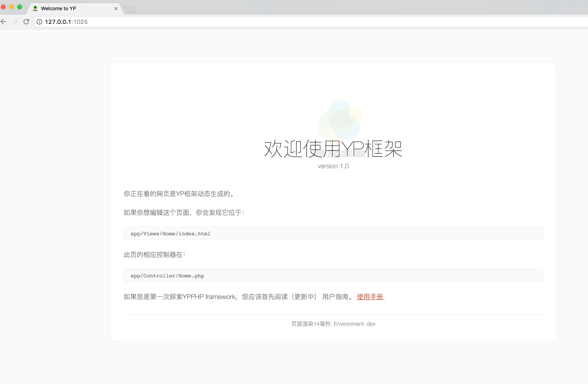

# YPAMS简介

YPAMS系统一个自带权限认证的后台管理系统，YPAMS采用[YPPHP](https://github.com/ly2513/YPPHP)框架开发，该项目自带H+前端框架源码。
 ```


 ## 系统快速上手
 因为这框架所依赖的第三方组件都采用的是Composer管理, 所以在使用YP框架之前,请确保本地已安装**Composer**包管理软件,关于Composer的安装在此不再详细说明,
 如果本地已安装Composer包管理软件, 接下来在本地克隆该框架,在命令行中输入

 ```sh
 git clone  https://github.com/ly2513/YPPHP.git

 #或者

 git clone git@github.com:ly2513/YPPHP.git
 ```
 克隆下来后,在框架的根目录(YPPHP/)执行下命令

 ```php
 composer update
 ```
将框架所需要依赖的第三方组件更新到本地, 根目录下将会创建一个**vendor**文件夹,该目录下存放着框架所依赖的第三方组件。更新完成后,进入到根目录下的**public**目录下,输入命令

 ```php
 php -S 127.0.0.1:1025
 ```
 回车,你将看到如下界面




